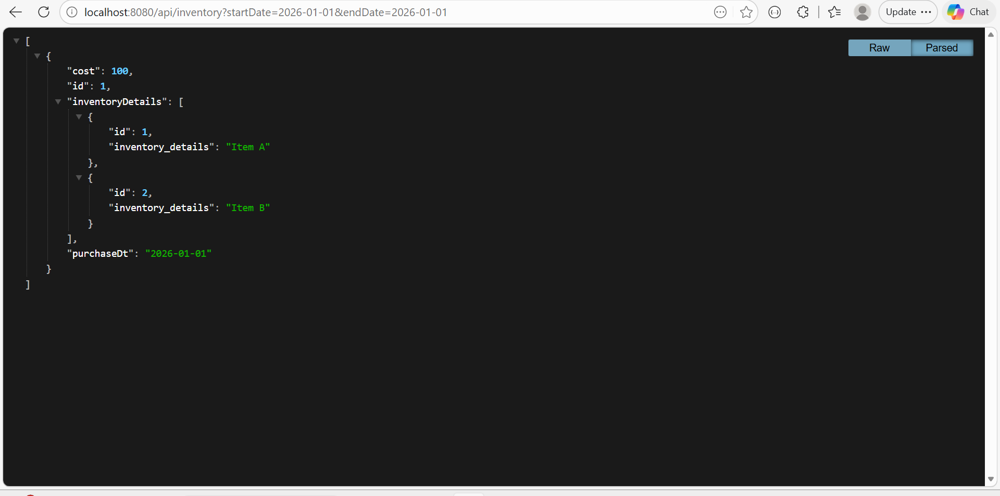

# 🚀 Assignment - 1 Using Java Language

This repository contains multiple backend assignments completed as part of the **Calsoft Internship Program** using Spring Boot, JPA, Hibernate, Redis, SSE Notifications, and REST APIs.

---

## 📁 Repository Structure

```text
Assignment-1/
├── README.md
├── screenshots/
│   ├── inventory-results.png
│   ├── devices-result.png
│   └── post-result.png
│
├── Inventory-Report-API/
├── Device-Config-Change-Notification-API/
└── Handling-Large-Dataset/
```

---

## 🛠 Common Tech Stack

| Layer      | Technology        |
|------------|-------------------|
| Language   | Java 17           |
| Framework  | Spring Boot       |
| ORM        | Spring Data JPA   |
| Database   | MySQL             |
| Build Tool | Maven             |
| Testing    | Postman / Browser |
| Server     | Embedded Tomcat   |

---

---

# Q1 — Inventory Report API

## 📌 What does it do?

Fetches inventory reports between two dates using Spring Boot + JPA.

---

## 🛠 Tech Stack

| Layer      | Technology         |
|------------|--------------------|
| Framework  | Spring Boot        |
| Database   | MySQL              |
| ORM        | Spring Data JPA    |
| Validation | Jakarta Validation |
| Build Tool | Maven              |

---

## 📁 Folder Structure

```text
Assignment-1/
└── Inventory-Report-API/
    ├── src/main/java/com/example/inventoryreportapi/
    │   ├── controller/
    │   │   └── InventoryController.java
    │   ├── entity/
    │   │   ├── Inventory.java
    │   │   └── InventoryDetails.java
    │   ├── repository/
    │   │   ├── InventoryRepository.java
    │   │   └── InventoryDetailsRepository.java
    │   ├── service/
    │   │   └── InventoryService.java
    │   └── InventoryReportApiApplication.java
    ├── src/main/resources/
    │   └── application.properties
    ├── pom.xml
    └── README.md
```

---

## ⚙️ Step-by-Step Setup

### Step 1: Install dependencies

```bash
mvn clean install
```

### Step 2: Run server

```bash
mvn spring-boot:run
```

---

## 🗄 MySQL Insert Query

```sql
INSERT INTO inventory (id, cost, purchase_dt)
VALUES
(1, 100, '2026-01-01'),
(2, 200, '2026-01-02'),
(3, 300, '2026-01-03');

INSERT INTO inventory_details (id, inventory_details, inventory_id)
VALUES
(1, 'Item A', 1),
(2, 'Item B', 1),
(3, 'Item C', 2),
(4, 'Item D', 3);
```

---

## 🌐 API Query

```http
GET http://localhost:8080/api/inventory?startDate=2026-01-01&endDate=2026-01-03
```

| Parameter   | Required | Format       | Description         |
|-------------|----------|--------------|---------------------|
| `startDate` | ✅ Yes   | `YYYY-MM-DD` | Start of date range |
| `endDate`   | ✅ Yes   | `YYYY-MM-DD` | End of date range   |

---

## 📤 Sample Response

```json
[
  {
    "id": 1,
    "purchaseDt": "2026-01-01",
    "cost": 100.0,
    "inventoryDetails": [
      { "id": 1, "inventoryDetails": "Item A" },
      { "id": 2, "inventoryDetails": "Item B" }
    ]
  },
  {
    "id": 2,
    "purchaseDt": "2026-01-02",
    "cost": 200.0,
    "inventoryDetails": [
      { "id": 3, "inventoryDetails": "Item C" }
    ]
  }
]
```

---

## ❌ Error Handling

| Scenario                      | Status | Message                          |
|-------------------------------|--------|----------------------------------|
| Missing `startDate`/`endDate` | `400`  | Required parameter missing       |
| `startDate` after `endDate`   | `400`  | startDate must be before endDate |
| No records in range           | `200`  | Returns empty array `[]`         |
| Server / DB error             | `500`  | Internal Server Error            |

---

## 📸 Output Screenshot



---

---

# Q2 — Device Config Change Notification API

## 📌 What does it do?

Tracks device configuration changes and sends real-time notifications using Server-Sent Events (SSE).

---

## 🛠 Tech Stack

| Layer      | Technology      |
|------------|-----------------|
| Framework  | Spring Boot     |
| Database   | MySQL           |
| ORM        | Spring Data JPA |
| Real-Time  | SSE             |
| Scheduling | @Scheduled      |
| Build Tool | Maven           |

---

## 📁 Folder Structure

```text
Assignment-1/
└── Device-Config-Change-Notification-API/
    ├── src/main/java/com/example/deviceconfigchangenotificationapi/
    │   ├── controller/
    │   │   └── DeviceController.java
    │   ├── entity/
    │   │   └── Device.java
    │   ├── repository/
    │   │   └── DeviceRepository.java
    │   ├── service/
    │   │   └── SseEmitterRegistry.java
    │   └── DeviceConfigChangeNotificationApiApplication.java
    ├── src/main/resources/
    │   └── application.properties
    ├── pom.xml
    └── README.md
```

---

## ⚙️ Step-by-Step Setup

### Step 1: Install dependencies

```bash
mvn clean install
```

### Step 2: Run server

```bash
mvn spring-boot:run
```

---

## 🗄 MySQL Insert Query

```sql
INSERT INTO devices (id, device_ip, device_details, config_changed)
VALUES
(1, '192.168.1.10', 'Cisco Router',      false),
(2, '192.168.1.11', 'Fortinet Firewall', true),
(3, '192.168.1.12', 'Access Point',      false);
```

---

## 🌐 API Queries

### Get all devices

```http
GET http://localhost:8080/api/devices
```

### Subscribe for notifications (SSE)

```http
GET http://localhost:8080/api/devices/notifications
```

### Mark config changed

```http
POST http://localhost:8080/api/devices/1/config-changed
```

---

## 📤 Sample Notification (SSE JSON)

```json
{
  "deviceId": 2,
  "deviceIp": "192.168.1.11",
  "message": "Configuration changed for device: 192.168.1.11",
  "timestamp": "2026-05-04T10:45:00"
}
```

---

## 🔁 Notification Flow

```
Batch Job sets config_changed = true in DB
              ↓
@Scheduled polls DB every 5 seconds
              ↓
Finds all devices where config_changed = true
              ↓
Pushes SSE JSON notification to all subscribed clients
              ↓
Resets config_changed = false
```

---

## ❌ Error Handling

| Scenario                | Status | Message                |
|-------------------------|--------|------------------------|
| Device ID not found     | `404`  | Device not found       |
| SSE client disconnected | —      | Auto-removed from list |
| Server / DB error       | `500`  | Internal Server Error  |

---

## 📸 Output Screenshot


---

---

# Q3 — Handling Large Dataset / API Timeout

## 📌 Problem Statement

The API `GET /getPostsUploaded` was timing out because millions of records were fetched at once from the Posts table.

---

## ✅ Solution Implemented

- **Pagination** — fetch records in small pages using `Pageable`
- **Sorting** — order results at DB level using indexed columns
- **Redis Caching** — serve repeated page requests in ~2ms
- **Optimized API Response** — include metadata (totalPages, totalItems)

---

## 🛠 Tech Stack

| Layer        | Technology      |
|--------------|-----------------|
| Framework    | Spring Boot     |
| Database     | MySQL           |
| ORM          | Spring Data JPA |
| Cache        | Redis           |
| Optimization | Pagination      |
| Build Tool   | Maven           |

---

## 📁 Folder Structure

```text
Assignment-1/
└── Handling-Large-Dataset/
    ├── src/main/java/com/example/handlinglargedataset/
    │   ├── controller/
    │   │   └── PostController.java
    │   ├── entity/
    │   │   └── Post.java
    │   ├── repository/
    │   │   └── PostRepository.java
    │   ├── service/
    │   │   └── PostService.java
    │   ├── config/
    │   │   └── RedisConfig.java
    │   └── HandlingLargeDatasetApplication.java
    ├── src/main/resources/
    │   └── application.properties
    ├── pom.xml
    └── README.md
```

---

## ⚙️ Step-by-Step Setup

### Step 1: Install dependencies

```bash
mvn clean install
```

### Step 2: Run server

```bash
mvn spring-boot:run
```

---

## 🗄 MySQL Insert Query

```sql
INSERT INTO posts (id, post_by, post_dt, post_details)
VALUES
(1, 'Pranjal', '2026-05-01', 'Spring Boot Pagination'),
(2, 'Pranjal', '2026-05-02', 'Redis caching setup'),
(3, 'Pranjal', '2026-05-03', 'Optimized SQL queries'),
(4, 'Pranjal', '2026-05-04', 'Pagination testing');
```

---

## 🌐 API Query

```http
GET http://localhost:8080/getPostsUploaded?page=0&size=4&sortBy=post_dt
```

| Parameter | Required | Default | Description       |
|-----------|----------|---------|-------------------|
| `page`    | No       | `0`     | Page number       |
| `size`    | No       | `20`    | Records per page  |
| `sortBy`  | No       | `id`    | Column to sort by |

---

## 📤 Sample Response

```json
{
  "posts": [
    { "id": 1, "postBy": "Pranjal", "postDt": "2026-05-01", "postDetails": "Spring Boot Pagination" },
    { "id": 2, "postBy": "Pranjal", "postDt": "2026-05-02", "postDetails": "Redis caching setup" },
    { "id": 3, "postBy": "Pranjal", "postDt": "2026-05-03", "postDetails": "Optimized SQL queries" },
    { "id": 4, "postBy": "Pranjal", "postDt": "2026-05-04", "postDetails": "Pagination testing" }
  ],
  "currentPage": 0,
  "totalItems": 4,
  "totalPages": 1
}
```

---

## ⚡ Performance Improvement

| Strategy                    | Response Time    | Timeout Risk |
|-----------------------------|------------------|--------------|
| ❌ No Pagination (original) | > 30,000ms       | YES          |
| ✅ Pagination only          | ~120ms           | No           |
| ✅ Pagination + DB Index    | ~80ms            | No           |
| ✅ Pagination + Redis Cache | ~2ms (cache hit) | No           |

---

## ❌ Error Handling

| Scenario            | Status | Message                               |
|---------------------|--------|---------------------------------------|
| Invalid page number | `400`  | Page index must not be less than zero |
| Server / DB error   | `500`  | Internal Server Error                 |

---

## 📸 Output Screenshot


---

---

## 👨‍💻 Author

**Pranjal Singh**  
Intern — Engineering  
