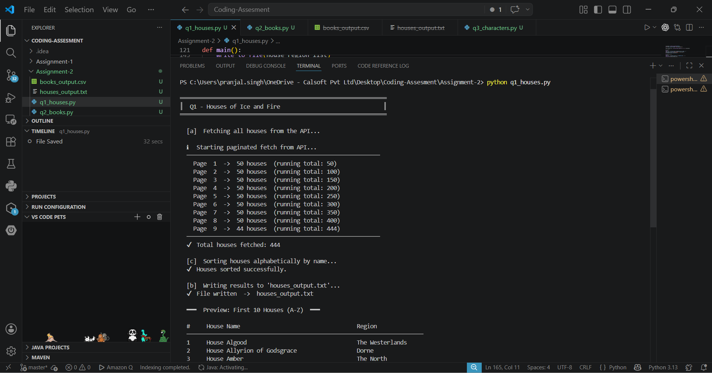
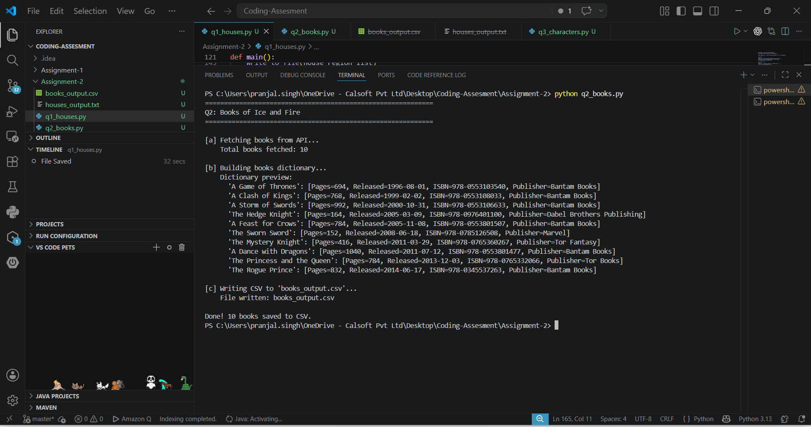

# 🔥 Ice & Fire API — Assignment 2

## 📌 Overview

A Python application that consumes the [Ice and Fire public API](https://anapioficeandfire.com)
and solves 3 tasks — fetching Houses, Books, and Characters, then exporting
the results to TXT, CSV, and Excel files.

| Question | Task | Output File |
|---|---|---|
| Q1 — Houses | Fetch all houses & regions → sort A–Z → export | `houses_output.txt` |
| Q2 — Books | Fetch books → build dictionary → export | `books_output.csv` |
| Q3 — Characters | Fetch characters → count seasons → sort desc → export | `characters_output.xlsx` |

---

## 🛠 Tech Stack

| Layer | Technology |
|---|---|
| Language | Python 3.12 |
| HTTP Client | requests |
| CSV Export | csv (stdlib) |
| Excel Export | openpyxl |
| Build Tool | pip |

---

## 📁 Folder Structure

```text
assignment-2/
├── q1_houses.py               ← Q1: Fetch houses → sort A–Z → TXT
├── q2_books.py                ← Q2: Fetch books → dictionary → CSV
├── q3_characters.py           ← Q3: Fetch characters → sort by seasons → Excel
├── output/
│   ├── houses_output.txt      ← Q1 output
│   ├── books_output.csv       ← Q2 output
│   └── characters_output.xlsx ← Q3 output
├── screenshots/
│   ├── house-result.png
│   ├── books-result.png
│   ├── character-result.png
│   └── character-top-10-result.png
├── requirements.txt
└── README.md
```

---

## ⚙️ Setup & Run

### Step 1 — Install dependencies

```bash
pip install -r requirements.txt
```

### Step 2 — Run each question

```bash
# Q1 — Houses
python q1_houses.py

# Q2 — Books
python q2_books.py

# Q3 — Characters
python q3_characters.py
```

---

## 📋 requirements.txt

```text
requests
openpyxl
```

---

## 🌐 API Endpoints Used

| Question | API URL |
|---|---|
| Q1 | `https://anapioficeandfire.com/api/houses` |
| Q2 | `https://anapioficeandfire.com/api/books` |
| Q3 | `https://anapioficeandfire.com/api/characters` |

---

---

## 📝 Assignment 2 — Questions

---

### ❓ Question 1 — Houses of Ice and Fire

**File:** `q1_houses.py`
**API:** `https://anapioficeandfire.com/api/houses`

#### Tasks
```
a. Create a list of all houses and regions from the API
b. Write this list in a text file
c. Order all houses alphabetically
```

#### What the code does
- Calls the API with pagination (page size 50) to fetch all 444 houses
- Extracts `name` and `region` from each house entry
- Sorts the list alphabetically by house name (case-insensitive)
- Writes the sorted list to `houses_output.txt` in a formatted table
- Prints a live terminal preview with page-by-page fetch log and region bar chart

#### Output — `houses_output.txt`
```
Houses of Ice and Fire - Sorted Alphabetically
======================================================================

#     House Name                                   Region
--------------------------------------------------------------------------------
1     House Algood                                 Westerlands
2     House Ambrose                                The Reach
3     House Arryn of the Eyrie                     The Vale
...
444   House Wyl of the Boneway                     Dorne
```

#### Terminal Output
```
══════════════════════════════════════════════════════════════
║  Q1 - Houses of Ice and Fire                              ║
══════════════════════════════════════════════════════════════

  [a]  Fetching all houses from the API...

  ℹ  Starting paginated fetch from API...
  ──────────────────────────────────────────────────────────
    Page  1  ->  50 houses  (running total:  50)
    Page  2  ->  50 houses  (running total: 100)
    ...
    Page  9  ->  44 houses  (running total: 444)
  ──────────────────────────────────────────────────────────
  ✔  Total houses fetched: 444

  [c]  Sorting houses alphabetically by name...
  ✔  Houses sorted successfully.

  [b]  Writing results to 'houses_output.txt'...
  ✔  File written  ->  houses_output.txt

  ━━━  Preview: First 10 Houses (A-Z)  ━━━

  #     House Name                                   Region
  ───────────────────────────────────────────────────────────────────────
  1     House Algood                                 Westerlands
  2     House Ambrose                                The Reach
    ... and 434 more houses (see houses_output.txt)
  ───────────────────────────────────────────────────────────────────────

  ━━━  Houses by Region  ━━━

  Region                             Count  Bar
  ──────────────────────────────────────────────────────────
  The North                             77  █████████████████████████
  The Reach                             52  ████████████████████████
  ──────────────────────────────────────────────────────────
  ✔  Q1 Complete!  444 houses saved to houses_output.txt
```

#### 📸 Screenshot


---

### ❓ Question 2 — Books of Ice and Fire

**File:** `q2_books.py`
**API:** `https://anapioficeandfire.com/api/books`

#### Tasks
```
a. Read list of books from the API
b. Create dictionary of { book_name: [pages, date_of_release, ISBN, publisher] }
c. Create a CSV file with this dictionary
```

#### What the code does
- Fetches all 12 books from the API in a single request
- Builds a Python dictionary with book name as key and
  `[numberOfPages, released, isbn, publisher]` as value
- Parses the ISO-8601 release date into `YYYY-MM-DD` format
- Exports the dictionary to `books_output.csv` using the csv module

#### Dictionary Structure
```python
{
  "A Game of Thrones":  [694,  "1996-08-01", "978-0553103540", "Bantam Books"],
  "A Clash of Kings":   [768,  "1998-11-16", "978-0553108033", "Bantam Books"],
  "A Storm of Swords":  [973,  "2000-08-08", "978-0553106633", "Bantam Books"],
  ...
}
```

#### Output — `books_output.csv`
```
Book Name,Pages,Date of Release,ISBN,Publisher
A Game of Thrones,694,1996-08-01,978-0553103540,Bantam Books
A Clash of Kings,768,1998-11-16,978-0553108033,Bantam Books
A Storm of Swords,973,2000-08-08,978-0553106633,Bantam Books
The Hedge Knight,164,1998-06-01,978-0976401100,Dabel Brothers Productions
A Feast for Crows,753,2005-10-17,978-0553801507,Bantam Books
A Dance with Dragons,1016,2011-07-12,978-0553801477,Bantam Books
...
```

#### Terminal Output
```
══════════════════════════════════════════════════════════════
║  Q2 - Books of Ice and Fire                               ║
══════════════════════════════════════════════════════════════

  [a]  Fetching books from the API...
  ✔  Total books fetched: 12

  [b]  Building books dictionary...
  ✔  Dictionary built with 12 entries.

  ━━━  Books Dictionary Preview  ━━━

  Book Name                          Pages   Released     ISBN
  ───────────────────────────────────────────────────────────────────────
  A Game of Thrones                  694     1996-08-01   978-0553103540
  A Clash of Kings                   768     1998-11-16   978-0553108033
  A Storm of Swords                  973     2000-08-08   978-0553106633
  ...
  ───────────────────────────────────────────────────────────────────────

  [c]  Writing CSV to 'books_output.csv'...
  ✔  File written  ->  books_output.csv

  ──────────────────────────────────────────────────────────
  ✔  Q2 Complete!  12 books saved to books_output.csv
  ──────────────────────────────────────────────────────────
```

#### 📸 Screenshot


---

### ❓ Question 3 — Characters of Ice and Fire

**File:** `q3_characters.py`
**API:** `https://anapioficeandfire.com/api/characters`

#### Tasks
```
a. Get all characters from the API
b. Find how many seasons the character was part of
c. Sort according to the number of appearances in the season
d. Add all available sorted data into an Excel file
```

#### What the code does
- Calls the API with pagination (page size 50) to fetch all 2138+ characters
- Reads the `tvSeries` list for each character and counts non-blank entries
  to get the season count
- Sorts all characters by season count in descending order
- Exports all fields (Name, Gender, Culture, Born, Died, Season Count,
  TV Seasons, Aliases, Titles, Books Count, POV Books, Played By)
  to `characters_output.xlsx` with:
  - Dark blue formatted header row
  - Alternating row colours
  - Frozen header pane
  - Auto-filter enabled on all columns

#### Season Count Logic
```python
# Filters blank strings the API sometimes returns for book-only characters
season_count = len([s for s in character["tvSeries"] if s.strip()])
```

#### Top Characters by Season Appearances
```
Name                      Seasons
──────────────────────────────────
Jon Snow                     8
Daenerys Targaryen           8
Tyrion Lannister             8
Cersei Lannister             8
Arya Stark                   8
Sansa Stark                  8
Jaime Lannister              8
Jorah Mormont                8
Theon Greyjoy                8
Varys                        8
Bran Stark                   7
Petyr Baelish                7
...
```

#### Terminal Output
```
══════════════════════════════════════════════════════════════
║  Q3 - Characters of Ice and Fire                          ║
══════════════════════════════════════════════════════════════

  [a]  Fetching all characters from the API...

  ℹ  Starting paginated fetch from API...
  ──────────────────────────────────────────────────────────
    Page  1  ->  50 characters  (running total:   50)
    Page  2  ->  50 characters  (running total:  100)
    ...
    Page 43  ->  26 characters  (running total: 2138)
  ──────────────────────────────────────────────────────────
  ✔  Total characters fetched: 2138

  [b]  Computing season count for each character...
  ✔  Season count computed.

  [c]  Sorting by season appearances (descending)...
  ✔  Characters sorted successfully.

  ━━━  Top 10 Characters by Season Appearances  ━━━

  #     Name                      Seasons
  ──────────────────────────────────────────────────────────
  1     Jon Snow                     8
  2     Daenerys Targaryen           8
  3     Tyrion Lannister             8
  ...
  ──────────────────────────────────────────────────────────

  [d]  Writing sorted data to 'characters_output.xlsx'...
  ✔  File written  ->  characters_output.xlsx

  ──────────────────────────────────────────────────────────
  ✔  Q3 Complete!  2138 characters saved to characters_output.xlsx
  ──────────────────────────────────────────────────────────
```

#### 📸 Screenshots


---

## 📂 Generated Output Files

| File | Contents |
|---|---|
| `output/houses_output.txt` | 444 houses sorted A–Z with region names |
| `output/books_output.csv` | 12 books with pages, release date, ISBN, publisher |
| `output/characters_output.xlsx` | 2138+ characters sorted by season count (desc) |

---

## 🐛 Troubleshooting

### API returns 403 / connection error
The Ice and Fire API has rate limits. Wait a few seconds and retry, or reduce
`page_size` in the script from `50` to `10`.

### openpyxl not found
```bash
pip install openpyxl
```

### Output folder missing
Run the scripts from inside the `assignment-2/` folder:
```bash
cd assignment-2
python q1_houses.py
```

---

## 👨‍💻 Author

**Pranjal Singh**
Intern — Engineering
