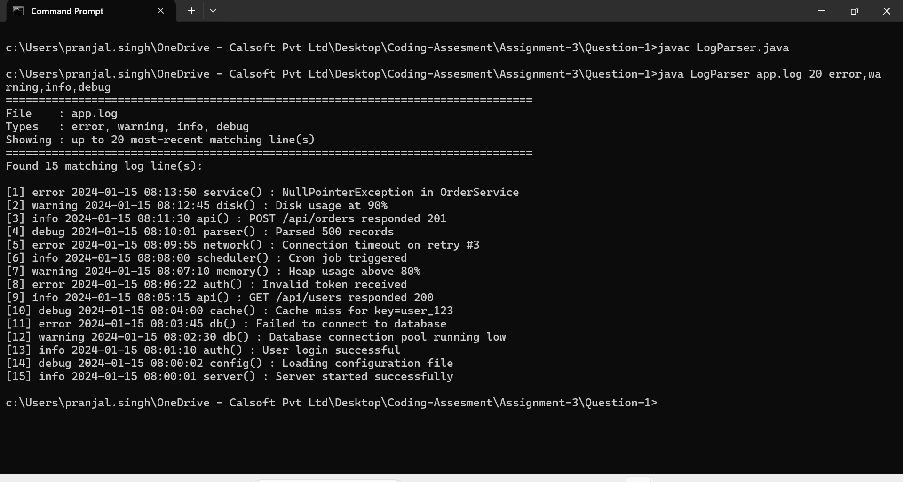
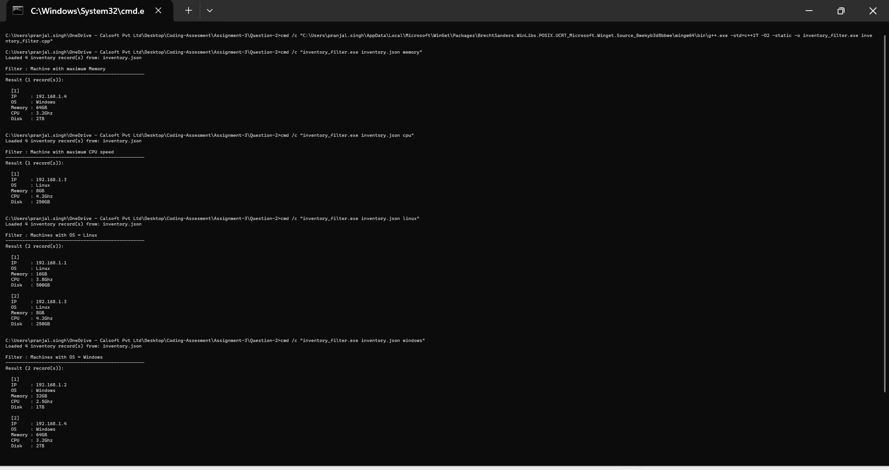
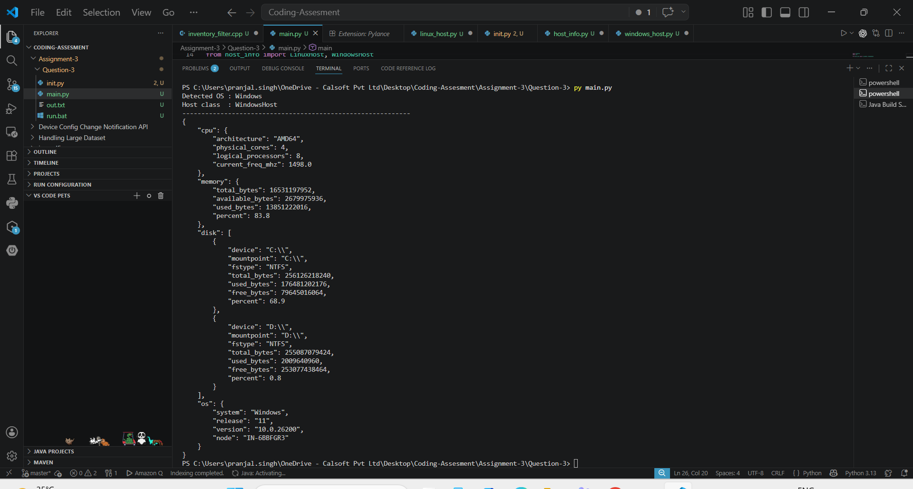

# Coding Assessment – Assignment 3

Three programming solutions covering log parsing, inventory filtering, and real-time hardware info.

| Question | Title | Language |
|---|---|---|
| Q1 | Log File Parser | Java |
| Q2 | Inventory Filter | C++ |
| Q3 | Hardware Info Viewer | Python |

---

## Question 1 – Log File Parser

**Language:** Java

### Problem Statement

Given a log file, parse it based on log type and display the most recent matching entries.

### Input Parameters

| # | Parameter | Required | Default | Description |
|---|---|---|---|---|
| 1 | `filePath` | Yes | — | Path to the `.log` file |
| 2 | `numLines` | No | `10` | Number of recent lines to display |
| 3 | `logTypes` | No | `error` | Comma-separated list: `error`, `warning`, `info`, `debug` |

### Validation

- Throws `IllegalArgumentException` if file path is invalid or file does not exist
- Throws `IllegalArgumentException` if any log type is not in `{error, warning, info, debug}`
- Throws `IOException` if the file cannot be read

### Design

```
parseLogs(filePath, numLines, logTypes)
  └── Validates inputs
  └── Reads all lines with Files.readAllLines()
  └── Iterates bottom-to-top (most recent first)
  └── Detects level by parsing [LEVEL] bracket
  └── Returns up to numLines matches
```

### Project Structure

```
Question-1/
  LogParser.java        ← Single-file solution (parseLogs + main)
```

### How to Run

```bash
# Compile
javac LogParser.java

# Default: 10 lines, type = error
java LogParser app.log

# 20 most-recent lines across all types
java LogParser app.log 20 error,warning,info,debug

# 5 most-recent INFO lines
java LogParser app.log 5 info
```

### Test Results

| Test Case | Command | Result |
|---|---|---|
| Default | `java LogParser app.log` | ✅ Last 10 ERRORs |
| Multi-type | `java LogParser app.log 20 error,warning,info,debug` | ✅ 15 lines found |
| Single type | `java LogParser app.log 5 info` | ✅ 5 INFO lines |
| Invalid path | `java LogParser /bad/path.log` | ✅ Exception raised |
| Invalid type | `java LogParser app.log 5 badtype` | ✅ Exception raised |

## 📸 Result Screenshots

<p align="center">
  
</p>

---

## Question 2 – Inventory Filter

**Language:** C++ (C++17)

### Problem Statement

Given a JSON inventory file, filter machines by maximum Memory, maximum CPU speed, or OS type.

### Input Parameters

| Filter Criteria | Behaviour |
|---|---|
| `memory` | Returns the machine with the highest RAM |
| `cpu` | Returns the machine with the highest CPU speed |
| `linux` | Returns all Linux machines |
| `windows` | Returns all Windows machines |

### Validation

- Throws `std::invalid_argument` if filter criteria is missing
- Throws `std::invalid_argument` if filter criteria is not in `{memory, cpu, linux, windows}`
- Throws `std::runtime_error` if the file cannot be opened

### Design – Strategy Pattern

```
InventoryItem        — value object (ip, os, memory, cpu, disk)
InventoryParser      — single-pass JSON parser (no external library)
FilterStrategy       — abstract base class
  ├── MaxMemoryFilter  — std::max_element on memoryValue()
  ├── MaxCpuFilter     — std::max_element on cpuValue()
  └── OsFilter         — case-insensitive OS match
InventoryFilter      — context: runs any FilterStrategy
makeStrategy()       — factory: maps CLI string → strategy
```

### Optimisations for Large Files

- File read once into `std::string` via `rdbuf()` (single syscall)
- Custom single-pass parser — no DOM, minimal heap allocation
- Numeric extraction (`"16GB"` → `16.0`) done inline via char scan
- `std::max_element` for O(n) max search — no sorting needed

### Project Structure

```
Question-2/
  inventory_filter.cpp   ← Complete solution (parser + OOP + main)
  inventory.json         ← Sample input
```

### How to Build & Run

```bash
# Build
g++ -std=c++17 -O2 -o inventory_filter inventory_filter.cpp

# Filter by maximum memory
./inventory_filter inventory.json memory

# Filter by maximum CPU
./inventory_filter inventory.json cpu

# Filter by OS type
./inventory_filter inventory.json linux
./inventory_filter inventory.json windows
```

### Test Results

| Filter | Result |
|---|---|
| `memory` | ✅ 1 record — highest RAM machine |
| `cpu` | ✅ 1 record — highest CPU machine |
| `linux` | ✅ 2 records — all Linux machines |
| `windows` | ✅ 2 records — all Windows machines |
| missing criteria | ✅ Exception: filter criteria required |
| `disk` (invalid) | ✅ Exception: invalid filter criteria |
| bad file path | ✅ Exception: cannot open file |

## 📸 Result Screenshots

<p align="center">
  
</p>


---

## Question 3 – Hardware Info Viewer

**Language:** Python 3

### Problem Statement

Display real-time hardware information of the system using OOP and Python's package/module system.

### Design – Template Method (ABC)

```
host_info/                  ← Python package
  __init__.py               ← Exports HostInfo, LinuxHost, WindowsHost
  host_info.py              ← Abstract base class (HostInfo)
  linux_host.py             ← Concrete: LinuxHost
  windows_host.py           ← Concrete: WindowsHost
main.py                     ← Entry point (auto-detects OS)
```

### Class Hierarchy

| Class | Type | Responsibility |
|---|---|---|
| `HostInfo` | Abstract (ABC) | Defines attributes + abstract `get_hardware_info()` |
| `LinuxHost` | Concrete | Reads `/proc/cpuinfo` + `psutil` for all metrics |
| `WindowsHost` | Concrete | Uses `WMIC` + `psutil` for all metrics |

### Attributes Collected

| Attribute | Content |
|---|---|
| `hostname` | System hostname |
| `ip` | Primary IPv4 address |
| `memory` | total_GB, used_GB, free_GB, percent |
| `cpu` | model, physical_cores, logical_cores, MHz, usage_percent |
| `disk_size` | Per mount-point: device, fstype, total/used/free GB, percent |

### Shared Logic in HostInfo (parent class)

- `_get_hostname()` — common across all platforms
- `_get_ip()` — UDP-connect trick, no network traffic, works on all OS
- `display_hardware_info()` — prints JSON with `json.dumps(indent=4)`, no duplication in subclasses

### Project Structure

```
Question-3/
  main.py
  host_info/
    __init__.py
    host_info.py
    linux_host.py
    windows_host.py
```

### Dependencies

```bash
pip install psutil
```

### How to Run

```bash
# Auto-detects OS and instantiates the right class
python main.py
```

### Sample Output (Windows)

```json
{
    "hostname": "IN-6BBFGR3",
    "ip": "192.168.1.10",
    "cpu": {
        "architecture": "AMD64",
        "physical_cores": 4,
        "logical_processors": 8,
        "current_freq_mhz": 1498.0
    },
    "memory": {
        "total_bytes": 16531197952,
        "used_bytes": 13851222016,
        "percent": 83.8
    },
    "disk": [
        {
            "device": "C:\\",
            "mountpoint": "C:\\",
            "fstype": "NTFS",
            "total_bytes": 256126218240,
            "used_bytes": 176481202176,
            "free_bytes": 79645016064,
            "percent": 68.9
        }
    ],
    "os": {
        "system": "Windows",
        "release": "11",
        "version": "10.0.26200",
        "node": "IN-6BBFGR3"
    }
}
```

---
## 📸 Result Screenshots

<p align="center">
  
</p>


## 👨‍💻 Author
 
**Pranjal Singh**
Intern — Engineering
