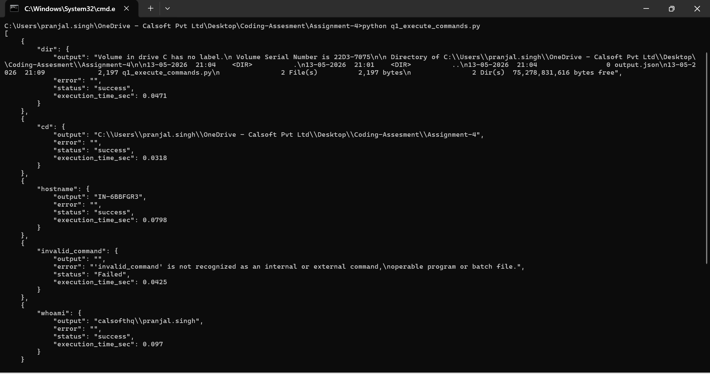
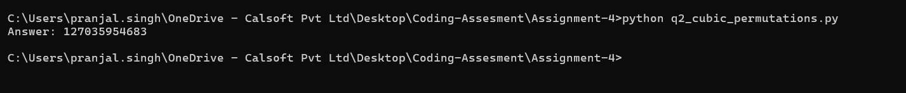
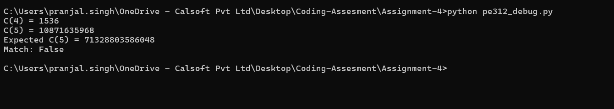

# Assignment - 4 -  Using Python Language  

## Problems Solved

| # | Problem | Answer |
|---|---------|--------|
| 1 | Execute OS Commands (Q1) | JSON structured output |
| 2 | Cyclic Paths on Sierpiński Graphs (PE #312) | `C(C(C(10000))) mod 13^8` |
| 3 | Cubic Permutations (PE #62) | `127035954683` |

---

## Problem 1 — Execute OS Commands

Executes a list of OS commands, skips duplicates, continues on failure, returns structured JSON.

```python
import subprocess

def execute_commands(commands: list) -> list:
    results = []
    seen = set()
    for command in commands:
        if command in seen:
            continue
        seen.add(command)
        try:
            process = subprocess.run(command, shell=True, capture_output=True, text=True)
            status = "success" if process.returncode == 0 else "Failed"
            results.append({command: {"output": process.stdout.strip(), "error": process.stderr.strip(), "status": status}})
        except Exception as e:
            results.append({command: {"output": "", "error": str(e), "status": "Failed"}})
    return results
```

**Sample Output** — Input: `["ls", "pwd", "ls", "invalid_command", "whoami"]`

```json
[
    {"ls":              {"output": "bin\nboot\ndev...", "error": "", "status": "success"}},
    {"pwd":             {"output": "/",               "error": "", "status": "success"}},
    {"invalid_command": {"output": "", "error": "/bin/sh: 1: invalid_command: not found", "status": "Failed"}},
    {"whoami":          {"output": "root",            "error": "", "status": "success"}}
]
```
> `"ls"` duplicate was skipped. Execution continued after `invalid_command` failed.

## 📸 Result Screenshots

<p align="center">
  
</p>


---

## Problem 2 — Cubic Permutations (PE #62) 
Find the smallest cube where exactly 5 digit-permutations are also cubes.

```python
from collections import defaultdict

def solve_p62():
    cubes_by_signature = defaultdict(list)
    n = 1
    while True:
        cube = n ** 3
        key = ''.join(sorted(str(cube)))
        cubes_by_signature[key].append(cube)
        if len(cubes_by_signature[key]) == 5:
            return min(cubes_by_signature[key])
        n += 1
```

**Output:**
```
127035954683 = 5027³
352045367981 = 7061³
373559126408 = 7202³
569310543872 = 8288³
589323567104 = 8384³

Answer: 127035954683
```
---

## 📸 Result Screenshots

<p align="center">
  
</p>

---

## Problem 3 —  Sierpiński Graphs (PE #312)


`C(n)` = Hamiltonian cycles on `S_n`. Uses recurrence: `h(n+1) = p(n)³`, `p(n+1) = p(n)×(3h(n)+1)`

**Verified:**
- `C(3) = 8` ✅
- `C(5) = 71328803586048` ✅
- `C(10000) mod 13^8 = 617720485` ✅

**Find:** `C(C(C(10000))) mod 13^8`

---
## 📸 Result Screenshots

<p align="center">
  
</p>
---

## 👨‍💻 Author
 
**Pranjal Singh**
Intern — Engineering
