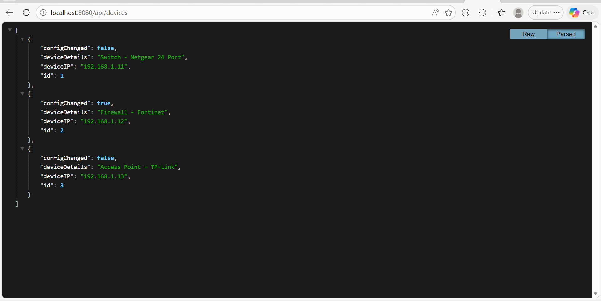
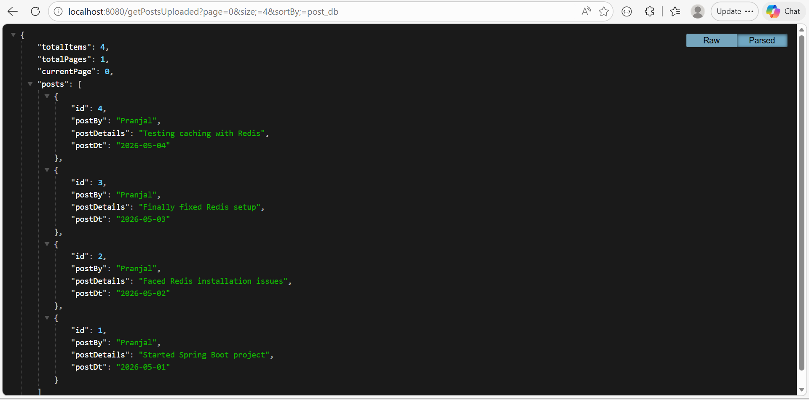
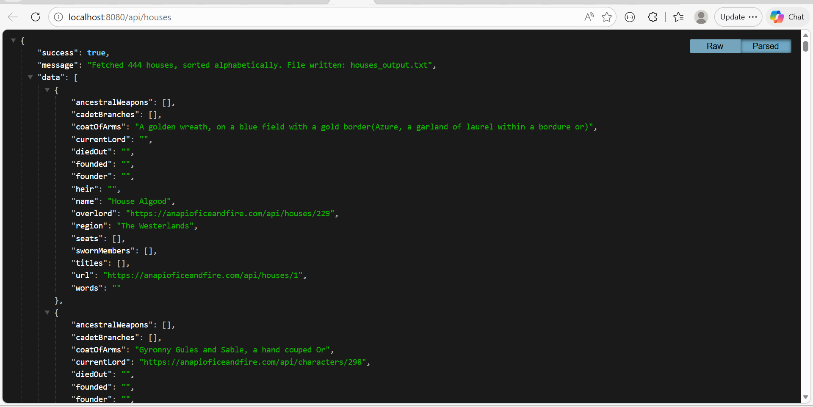
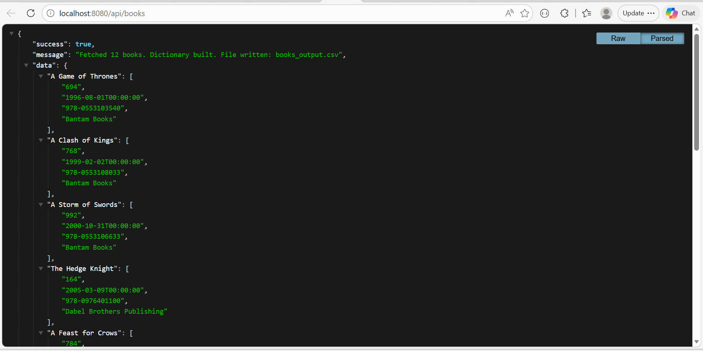
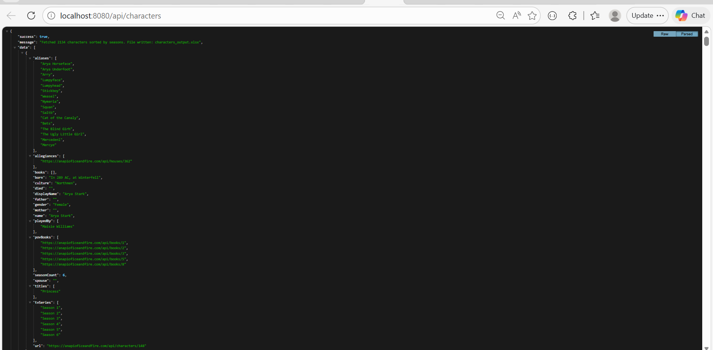
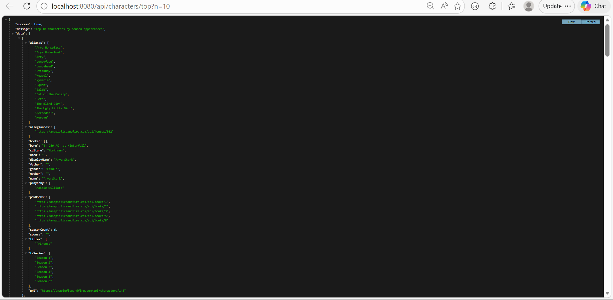

# 🚀 Coding Assignments – Spring Boot APIs

This repository contains multiple backend assignments completed as part of the Calsoft Internship Program using Spring Boot, JPA, Hibernate, Redis, SSE Notifications, Apache POI, and REST APIs.

---

# 📁 Repository Structure

```text
Assignments/
├── README.md
├── screenshots/
│   ├── books-result.png
│   ├── character-result.png
│   ├── character-top-10-result.png
│   ├── devices-result.png
│   ├── house-result.png
│   ├── inventory-results.png
│   └── post-result.png
│
├── Inventory-Report-API/
├── Device-Config-Change-Notification-API/
├── Handling-Large-Dataset/
└── iceandfire/
```

---

# 🛠 Common Tech Stack

| Layer | Technology |
|---|---|
| Language | Java 17 |
| Framework | Spring Boot |
| ORM | Spring Data JPA |
| Database | MySQL |
| Build Tool | Maven |
| API Testing | Postman / Browser |
| Server | Embedded Tomcat |

---

# Q1 - Inventory Report API

## 📌 What does it do?

Fetches inventory reports between two dates using Spring Boot + JPA.

---

## 🛠 Tech Stack

| Layer | Technology |
|---|---|
| Framework | Spring Boot |
| Database | MySQL |
| ORM | Spring Data JPA |
| Validation | Jakarta Validation |
| Build Tool | Maven |

---

## 📁 Folder Structure

```text
Inventory-Report-API/
├── src/main/java/com/example/inventoryreportapi/
│   ├── controller/
│   │   └── InventoryController.java
│   ├── entity/
│   │   ├── Inventory.java
│   │   └── InventoryDetails.java
│   ├── repository/
│   │   ├── InventoryRepository.java
│   │   └── InventoryDetailsRepository.java
│   ├── service/
│   │   └── InventoryService.java
│   └── InventoryReportApiApplication.java
│
├── src/main/resources/
│   └── application.properties
│
├── pom.xml
└── README.md
```

---

## ⚙️ Step-by-Step Setup

### Step 1: Install dependencies

```bash
mvn clean install
```

### Step 2: Run server

```bash
mvn spring-boot:run
```

---

## 🌐 API Query

```http
GET http://localhost:8080/api/inventory?startDate=2026-01-01&endDate=2026-01-01
```

---

## 🗄 MySQL Insert Query

```sql
INSERT INTO inventory (id, cost, purchase_dt)
VALUES
(1, 100, '2026-01-01'),
(2, 200, '2026-01-02'),
(3, 300, '2026-01-03');

INSERT INTO inventory_details (id, inventory_details, inventory_id)
VALUES
(1, 'Item A', 1),
(2, 'Item B', 1),
(3, 'Item C', 2),
(4, 'Item D', 3);
```

---

## 📸 Output Screenshot


---

# Q2 - Device Config Change Notification API

## 📌 What does it do?

Tracks device configuration changes and sends notifications using Server-Sent Events (SSE).

---

## 🛠 Tech Stack

| Layer | Technology |
|---|---|
| Framework | Spring Boot |
| Database | MySQL |
| ORM | Spring Data JPA |
| Real-Time | SSE |
| Build Tool | Maven |

---

## 📁 Folder Structure

```text
Device-Config-Change-Notification-API/
├── src/main/java/com/example/deviceconfigchangenotificationapi/
│   ├── controller/
│   │   └── DeviceController.java
│   ├── entity/
│   │   └── Device.java
│   ├── repository/
│   │   └── DeviceRepository.java
│   ├── service/
│   │   └── SseEmitterRegistry.java
│   └── DeviceConfigChangeNotificationApiApplication.java
│
├── src/main/resources/
│   └── application.properties
│
├── pom.xml
└── README.md
```

---

## ⚙️ Step-by-Step Setup

### Step 1: Install dependencies

```bash
mvn clean install
```

### Step 2: Run server

```bash
mvn spring-boot:run
```

---

## 🌐 API Queries

### Get all devices

```http
GET http://localhost:8080/api/devices
```

### Subscribe for notifications

```http
GET http://localhost:8080/api/devices/notifications
```

### Mark config changed

```http
POST http://localhost:8080/api/devices/1/config-changed
```

---

## 🗄 MySQL Insert Query

```sql
INSERT INTO devices (id, device_ip, device_details, config_changed)
VALUES
(1, '192.168.1.10', 'Cisco Router', false),
(2, '192.168.1.11', 'Fortinet Firewall', true),
(3, '192.168.1.12', 'Access Point', false);
```

---

## 📸 Output Screenshot



---

# Q3 - Handling Large Dataset API

## 📌 Problem Statement

The API was timing out because millions of records were fetched at once.

---

## ✅ Solution

Implemented:

- Pagination
- Sorting
- Redis caching
- Optimized API response

---

## 🛠 Tech Stack

| Layer | Technology |
|---|---|
| Framework | Spring Boot |
| Database | MySQL |
| ORM | Spring Data JPA |
| Cache | Redis |
| Optimization | Pagination |
| Build Tool | Maven |

---

## 📁 Folder Structure

```text
Handling-Large-Dataset/
├── src/main/java/com/example/handlinglargedataset/
│   ├── controller/
│   │   └── PostController.java
│   ├── entity/
│   │   └── Post.java
│   ├── repository/
│   │   └── PostRepository.java
│   ├── service/
│   │   └── PostService.java
│   ├── config/
│   │   └── RedisConfig.java
│   └── HandlingLargeDatasetApplication.java
│
├── src/main/resources/
│   └── application.properties
│
├── pom.xml
└── README.md
```

---

## ⚙️ Step-by-Step Setup

### Step 1: Install dependencies

```bash
mvn clean install
```

### Step 2: Run server

```bash
mvn spring-boot:run
```

---

## 🌐 API Query

```http
GET http://localhost:8080/getPostsUploaded?page=0&size=4&sortBy=post_dt
```

---

## 🗄 MySQL Insert Query

```sql
INSERT INTO posts (id, post_by, post_dt, post_details)
VALUES
(1, 'Pranjal', '2026-05-01', 'Spring Boot Pagination'),
(2, 'Pranjal', '2026-05-02', 'Redis caching setup'),
(3, 'Pranjal', '2026-05-03', 'Optimized SQL queries'),
(4, 'Pranjal', '2026-05-04', 'Pagination testing');
```

---

## 📸 Output Screenshot



---

# Q4 - Ice and Fire API Assignment

## 📌 What does it do?

Consumes the Ice and Fire public API and performs:

- Fetch Houses
- Fetch Books
- Fetch Characters
- Sort characters by season count
- Export TXT, CSV, Excel files

---

## 🛠 Tech Stack

| Layer | Technology |
|---|---|
| Framework | Spring Boot |
| External API | Ice and Fire API |
| File Export | Apache POI + OpenCSV |
| Validation | Spring Validation |
| Build Tool | Maven |

---

## 📁 Folder Structure

```text
iceandfire/
├── src/main/java/com/example/iceandfire/
│   ├── config/
│   │   └── AppConfig.java
│   ├── controller/
│   │   ├── HouseController.java
│   │   ├── BookController.java
│   │   └── CharacterController.java
│   ├── model/
│   │   ├── ApiResponse.java
│   │   ├── House.java
│   │   ├── Book.java
│   │   └── Character.java
│   ├── service/
│   │   ├── IceAndFireApiClient.java
│   │   ├── HouseService.java
│   │   ├── BookService.java
│   │   └── CharacterService.java
│   ├── util/
│   │   ├── AssignmentRunner.java
│   │   └── GlobalExceptionHandler.java
│   └── IceandfireApplication.java
│
├── src/main/resources/
│   └── application.properties
│
├── output/
│   ├── houses_output.txt
│   ├── books_output.csv
│   └── characters_output.xlsx
│
├── pom.xml
└── README.md
```

---

## ⚙️ Step-by-Step Setup

### Step 1: Install dependencies

```bash
mvn clean install
```

### Step 2: Run server

```bash
mvn spring-boot:run
```

---

## 🌐 API Queries

### Fetch Houses

```http
GET http://localhost:8080/api/houses
```

### Fetch Books

```http
GET http://localhost:8080/api/books
```

### Fetch Characters

```http
GET http://localhost:8080/api/characters
```

### Fetch Top Characters

```http
GET http://localhost:8080/api/characters/top?n=10
```

---

## 📂 Generated Output Files

```text
output/houses_output.txt
output/books_output.csv
output/characters_output.xlsx
```

---

## 📸 Output Screenshots

### Houses Result



---

### Books Result



---

### Characters Result



---

### Top 10 Characters Result



---

# ⚙️ Run Any Project

Go inside project folder:

```bash
cd project-name
```

Install dependencies:

```bash
mvn clean install
```

Run application:

```bash
mvn spring-boot:run
```

---

# 📌 Git Commands

```bash
git add .
git commit -m "Add assignment projects with screenshots"
git push origin main
```

If branch is master:

```bash
git push origin master
```

---

# 👨‍💻 Author

**Pranjal Singh**  
Intern - Engineering
